# STM32HAL

## 第一章 Cortex-M3


### 1.1 组成
#### 1. CM3Core是Cortex-M3的中央处理器 采用哈弗结构

#### 2. NVIC 中断控制器 采用向量中断机制
#### 3. SYSTICK 系统定时器 24位倒计时计数器
#### 4. MPU（存储保护单元）
#### 5. Bus Matrix (总线矩阵) 32位AHB总线互连网络
- 1. I-Code 总线：⽤于从代码存储区取指令和向量
- 2. D-Code 总线 ： ⽤于对代码存储区进⾏数据访问，例如,进⾏查表等操作
- 3. 系统总线:⽤于访问内存和外设，覆盖的区域包括⽚上 SRAM、⽚上外设、⽚外RAM、⽚外扩展设备以及系统区的部分空间
- 4. ⾼性能总线 (Advanced Hight-performance Bus，AHB) ： ⽤于访问⽚内⾼速的外设，主要是访问APB总线上的设备
#### 6. 调试接口
##### Cortex-M3处理器的调试系统主要由 SW-DP/SWJ-DP(Serial Wire-Debug Port / Serial Wire JTAG-Debug Port，串⾏线调试端⼝/串⾏线JTAG调试端⼝)、AHB-AF(Advanced High Performance Bus-Access Port，AHB 访问端⼝)
#### 7. 跟踪输出接口
##### Cortex-M3处理器具有指令跟踪(由 ETM 产⽣)、数据跟踪(由 DWT产⽣)和调试信息跟踪(由ITM 产⽣)3 种跟踪源,并⽀持各种跟踪机制
---

### 1.2 Cortex-M3编程模型
#### 1. 工作状态
- 在 Thumb 状态下处理器执⾏ 16 位和32 位半字对⻬的 Thumb-2 指令的状态
- 在调试状态下，处理器停⽌执⾏并进⾏调试时进⼊该状态
#### 2. 数据类型
- 字节(B)⻓为 8位
- 半字(halfword)⻓为16位，必须以 2字节对⻬的⽅式存取
- 字(word)⻓为 32位，必须以4字节对⻬的⽅式存取
#### 3. 寄存器
- R0~R12 通用寄存器
- R13（SP） 
- 堆栈指针寄存器 由一块连续的内存和一个堆栈指针组成 常用于临时保存将要或易于被修改的数据，以便将来能够恢复 同一时间，只能有一个SP
##### **主堆栈指针（MSP）** 复位后默认的堆指针 由操作系统内核、异常服务程序以及特权访问的用户使用
##### **进程堆栈指针（PSP）** 由常规用户程序使用
- R14（LR）链接寄存器 常用于调用子程序时保存返回地址
- R15（PC）程序计数器 用于存放下一条执行的指令的地址
- 特殊功能寄存器组
- 程序状态寄存器组xPSR
- 程序状态寄存器在其内部⼜被分为三个⼦状态寄存器：应⽤程序PSR(APSR，Application PSR)、中断号PSR(IPSR，Interrupt PSR)和执⾏PSR(EPSR，ExecutioPSR)  
- 中断屏蔽寄存器组（FAULMASK/PRMASK/BASEPRI）
- 控制寄存器 CONTROL 2位寄存器
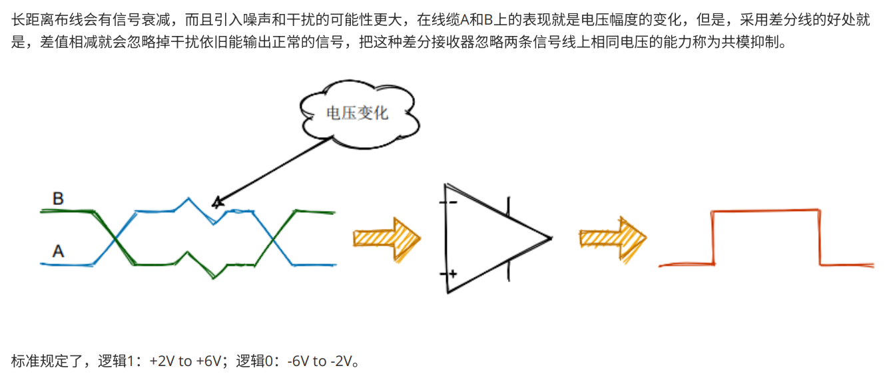
---

### 1.3 指令集
#### CISC/RISC Cortex-M3（RISC）
#### 1. 指令格式 操作码字段和操作数字段
#### 2. Thumb-2指令集 16/32混合指令集
---

### 1.4 操作模式与特权分级
#### 1. 特权分级
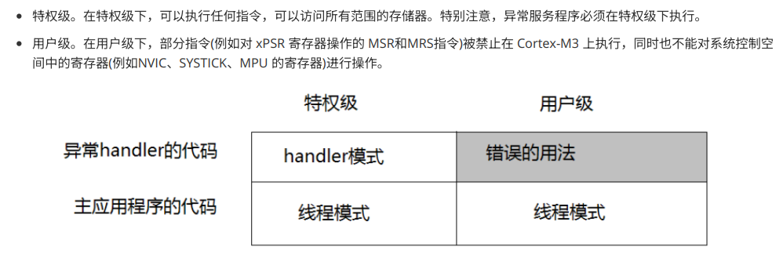
#### 2. 操作模式
##### 线程模式。当复位或异常返回时，Cortex-M3 进⼊该模式。通常情况下，线程模式是⽤⼾应⽤程序的运⾏模式。在该模式下,可以执⾏特权级和⽤⼾(⾮特权)级代码
##### 处理者模式。当发⽣异常时，Cortex-M3 进⼊该模式 通常情况下，Handler 模式是异常或中断服务程序或操作系统内核代码的运⾏模式。在该模式下,所有代码都是特权访问的
#### 3. 模式间的切换
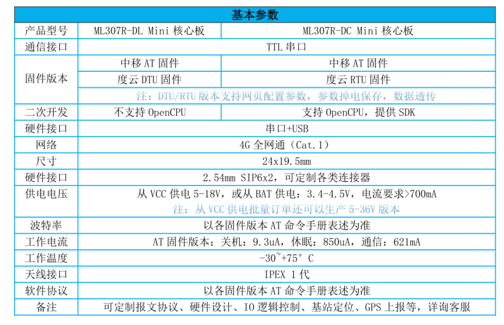
---

### 1.5 异常和中断
####  ARM 中凡是发⽣了打断程序正常执⾏流程的事件，都被称为异常(exception) 中断(interrupt)是⼀种特殊的异常
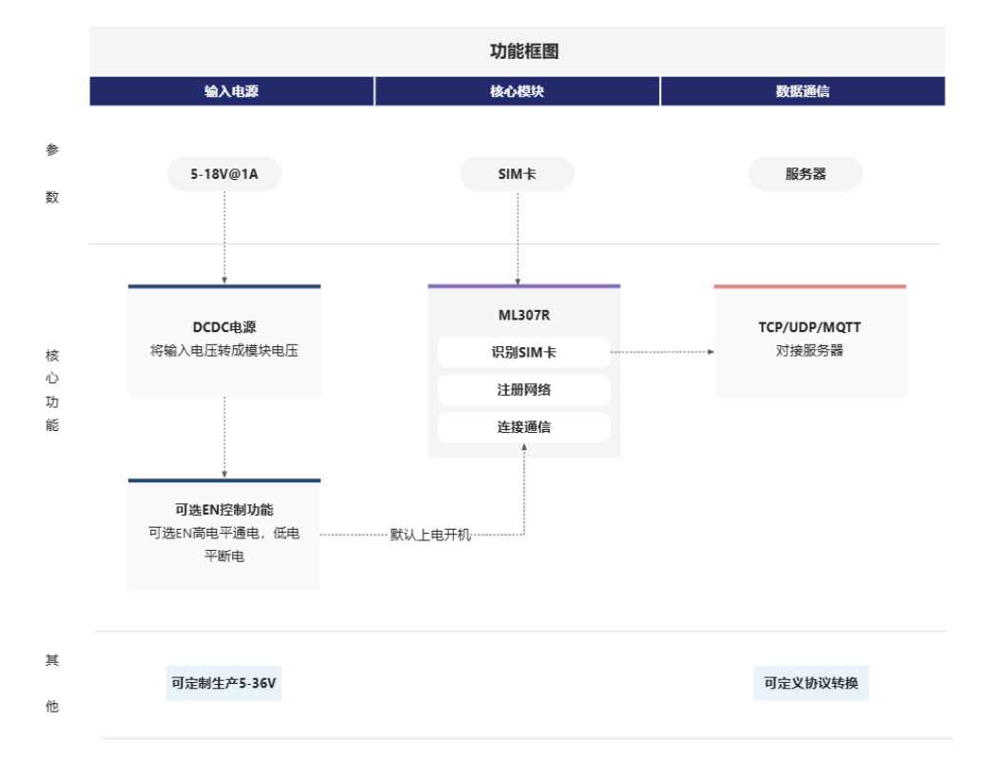
#### 异常向量表 Cortex-M3 的异常向量表其实是⼀个字(WORD)型数组，它的每个下标对应⼀种异常，⽽该下标对应的值则是该异常服务程序的⼊⼝地址 复位后，Cortex-M3 默认异常向量表位于0地址且每个地址占⽤ 4字节
```c
; Vector Table Mapped to Address 0 at Reset
AREA RESET, DATA, READONLY
EXPORT __Vectors
EXPORT __Vectors_End
EXPORT __Vectors_Size
__Vectors DCD __initial_sp ; Top of Stack
DCD Reset_Handler ; Reset Handler
DCD NMI_Handler ; NMI Handler
DCD HardFault_Handler ; Hard Fault Handler
DCD MemManage_Handler ; MPU Fault Handler
DCD BusFault_Handler ; Bus Fault Handler
DCD UsageFault_Handler ; Usage Fault Handler
DCD 0 ; Reserved
DCD 0 ; Reserved
DCD 0 ; Reserved
DCD 0 ; Reserved
DCD SVC_Handler ; SVCall Handler
DCD DebugMon_Handler ; Debug Monitor Handler
DCD 0 ; Reserved
DCD PendSV_Handler ; PendSV Handler
DCD SysTick_Handler ; SysTick Handler
; External Interrupts
DCD WWDG_IRQHandler ; Window Watchdog
DCD PVD_IRQHandler ; PVD through EXTI Line detect
DCD TAMPER_IRQHandler ; Tamper
DCD RTC_IRQHandler ; RTC
DCD FLASH_IRQHandler ; Flash
DCD RCC_IRQHandler ; RCC
DCD EXTI0_IRQHandler ; EXTI Line 0
DCD EXTI1_IRQHandler ; EXTI Line 1
DCD EXTI2_IRQHandler ; EXTI Line 2
DCD EXTI3_IRQHandler ; EXTI Line 3
DCD EXTI4_IRQHandler ; EXTI Line 4
DCD DMA1_Channel1_IRQHandler ; DMA1 Channel 1
DCD DMA1_Channel2_IRQHandler ; DMA1 Channel 2
DCD DMA1_Channel3_IRQHandler ; DMA1 Channel 3
DCD DMA1_Channel4_IRQHandler ; DMA1 Channel 4
DCD DMA1_Channel5_IRQHandler ; DMA1 Channel 5
DCD DMA1_Channel6_IRQHandler ; DMA1 Channel 6
DCD DMA1_Channel7_IRQHandler ; DMA1 Channel 7
DCD ADC1_2_IRQHandler ; ADC1_2
DCD USB_HP_CAN1_TX_IRQHandler ; USB High Priority or CAN1 TX
DCD USB_LP_CAN1_RX0_IRQHandler ; USB Low Priority or CAN1 RX0
DCD CAN1_RX1_IRQHandler ; CAN1 RX1
DCD CAN1_SCE_IRQHandler ; CAN1 SCE
DCD EXTI9_5_IRQHandler ; EXTI Line 9..5
DCD TIM1_BRK_IRQHandler ; TIM1 Break
DCD TIM1_UP_IRQHandler ; TIM1 Update
DCD TIM1_TRG_COM_IRQHandler ; TIM1 Trigger and Commutation
DCD TIM1_CC_IRQHandler ; TIM1 Capture Compare
DCD TIM2_IRQHandler ; TIM2
DCD TIM3_IRQHandler ; TIM3
DCD TIM4_IRQHandler ; TIM4
DCD I2C1_EV_IRQHandler ; I2C1 Event
DCD I2C1_ER_IRQHandler ; I2C1 Error
DCD I2C2_EV_IRQHandler ; I2C2 Event
DCD I2C2_ER_IRQHandler ; I2C2 Error
DCD SPI1_IRQHandler ; SPI1
DCD SPI2_IRQHandler ; SPI2
DCD USART1_IRQHandler ; USART1
DCD USART2_IRQHandler ; USART2
DCD USART3_IRQHandler ; USART3
DCD EXTI15_10_IRQHa`ndler ; EXTI Line 15..10
DCD RTC_Alarm_IRQHandler ; RTC Alarm through EXTI Line
DCD USBWakeUp_IRQHandler ; USB Wakeup from suspend
__Vectors_End
__Vectors_Size EQU __Vectors_End - __Vectors
```

---

### 1.6 Cortex-M3存储器系统 存储器映射
#### Cortex-M3 将存储器看作从0开始  向上编号的字节的线性集合，地址0单元存放第⼀个被保存的字节(0x20)，地址1单元存放第⼆个被保存的字节(0xAB)，依次类推，直到地址0XFFFFFFFF 单元存放最后⼀个被保存的字节(0x22)
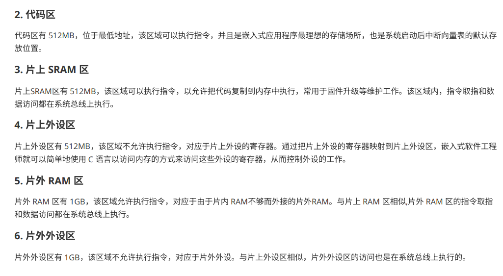
---

### 1.7 Cortex-M3低功耗模式
#### 1. 睡眠模式
##### Cortex-M3内核可以通过WFI/WFE指令进入睡眠，停止执行指令，只有NVIC的小部分保持唤醒
#### 2. 深度睡眠模式
##### Cortex-M3在微控制器的配合驱动下实现深度睡眠模式
---

## 第二章 RCC复位与时钟控制

### 2.1 复位（RESET） 将CPU的所有内部寄存器、状态和程序计数器等重置为预定值，以便系统能够从指定的程序入口重新启动
#### **重点**： STM32外部不加复位电路可以⼯作吗
##### 可以不⽤加外部复位电路，芯⽚上电会产⽣⼀个电源复位信号。 加上复位电路⼀般加复位电路(延时启动)是为了: 1.确保电源建⽴， 就是为了多⼀层保险。2.可以⼿动复位。
#### 1. 上电复位（POR）
##### 上电复位是指在计算机系统的电源打开时，硬件⾃动对所有系统进⾏初步的检查和配置，并对 CPU 进⾏⼀次复位操作，将 CPU 的内部状态清空为预设值，以便系统能够从程序的起始地址开始正常运⾏ 上电复位是计算机系统启动的必要步骤，它确保了系统在正常的状态下启动，并且能够正确地初始化所有硬件和软件组件
#### 2. 掉电复位（PDR）
##### 掉电复位是指当计算机系统没有电源供应时，系统内的所有电⼦元件会失去作⽤并停⽌⼯作，CPU 内部的状态也会随之丢失 当计算机系统重新接通电源时，系统会对所有硬件进⾏初步的检查和配置，并将 CPU 进⾏⼀次复位操作，将其内部状态清空为预设值，以便系统能够从程序的起始地址开始正常运⾏ 掉电复位是计算机系统在断电后恢复正常运⾏的必要步骤，它确保了系统在重新接通电源后能够正常⼯作
#### 3. 复位引脚复位
##### 复位引脚复位是指通过控制 CPU 的复位引脚来重置 CPU 内部的状态和寄存器, 以便让系统重新开始运⾏。当复位引脚收到⼀个低电平信号时，CPU 就会停⽌当前执⾏的程序，清除所有的内部状态和寄存器，从复位向量地址开始重新运⾏程序 复位引脚复位是⼀种硬件复位⽅式，⼀般由外围电路或者集成电路芯⽚⾃⾝来控制
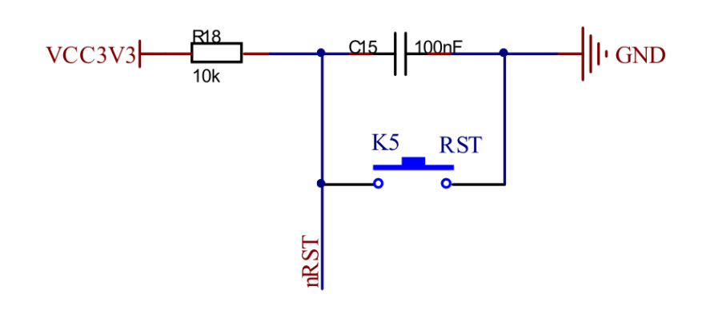
#### 4. 看门狗复位
##### 看⻔狗复位是⼀种硬件复位⽅式，它通过监视 CPU 或系统的运⾏时间，当运⾏时间超过预设值时，会强制CPU或整个系统进⾏复位，使其重新开始⼯作 复位看⻔狗电路通常由⼀个定时器组成，并设置⼀个特定的计数值作为计时器的溢出时间。计时器每到⼀定的时间就会产⽣⼀个特定的复位信号，以便CPU或整个系统得以重新启动
#### 5. 软件复位
##### STM32的软件复位是指通过写⼊特定的寄存器或使⽤相应的函数调⽤，来触发芯⽚内部的软件复位电路，将CPU的内部状态和寄存器清空为预设值，从⽽使系统能够重新从程序的起始地址开始正常运⾏。与硬件复位不同，软件复位可以由CPU的程序代码来触发 在STM32中，软件复位功能由RCC寄存器中的⼀个复位位完成，通过向该位写⼊特定的值即可触发软件复位
---

### 2.2 STM32F103启动过程
#### 初始化异常向量表、初始化时钟系统、初始化存储器系统、初始化堆栈、跳转到main函数等
---

#### ARM汇编语言
##### [LABEL] OPERATION [OPERAND] [:COMMENT]
- LABEL ：标号。是指令、变量或数据的地址或者常量。此项为可选项，如果有区必须顶格书写，后⾯不能加冒号
- OPERATION ：指令、宏指令、伪指令或伪操作 此项为必选项，但不能在⼀⾏开头顶格书写，⽽且前后必须有空格。特别注意，在ARM 汇编程序中，⼀条指令伪指令、寄存器名可以全部为⼤写字⺟,也可以全部为⼩写字⺟，但不要⼤⼩写混合使⽤。
- OPERAND ：操作的对象(即操作数)。可以是常量、变量，标号、寄存器或表达式。此项为可选项，若有多个操作数,操作数之间⽤逗号隔开。
- COMMENT：程序注释，增强代码的可读性。此项为可选项，由分号开始，可以顶格写

#### 指令
##### **B（）**B{<code>} Rm/label label或 Rm 是跳转的⽬标地址，跳转范围在 +/- 32MB 之间 例如，“B.”表⽰跳转到当前地址(“.”表⽰当前指令地址)，即进⼊死循环，等价于C语⾔的while(1)
##### **BX（跳转并切换指令集）**
##### **BLX（带返回地址的跳转并切换指令集）**

#### 伪指令

#### 伪操作
##### 数据定义伪操作 EQU(常量定义和赋值，与 C语⾔中#define 有异曲同⼯之妙) SPACE(分配⼀⽚连续的存储区域 等价于C语⾔的malloc) DCD(分配⼀⽚连续的字（4字节）存储区域并初始化)
---

##  第三章 GPIO

### 3.1 GPIO内部结构
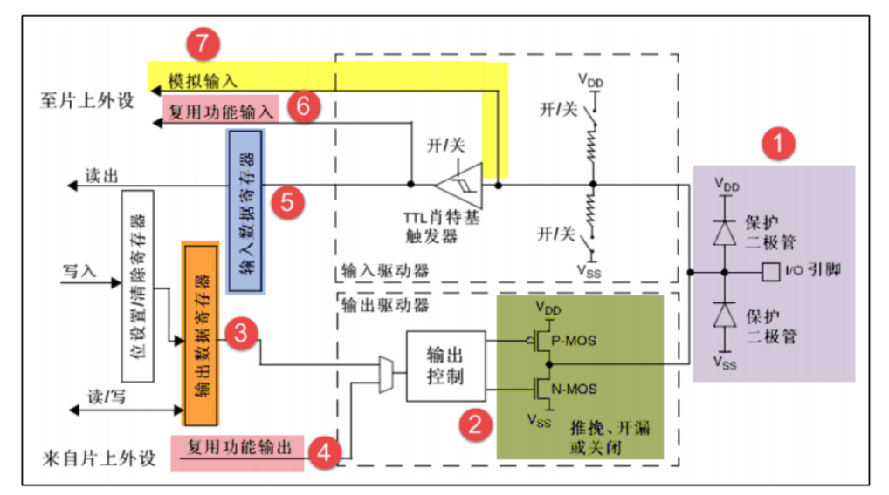
#### 保护二极管
##### 引脚的两个保护⼆级管可以防⽌引脚外部过⾼或过低的电压输⼊，当引脚电压⾼于VDD 时，上⽅的⼆极管导通，当引脚电压低于 VSS 时，下⽅的⼆极管导通，防⽌不正常电压引⼊芯⽚导致芯⽚烧毁  
#### 上下拉电阻
- 上拉电阻：当GPIO引脚被设置为输⼊模式时，如果外部设备没有连接到该引脚，那么该引脚会处于悬空状态，即电平状态不确定。此时，如果启⽤上拉电阻，可以将该引脚的电平拉⾼到⾼电平状态，避免了悬空状态的出现。当外部设备连接到该引脚时，上拉电阻不会影响外部设备的状态  
- 下拉电阻：与上拉电阻类似，当GPIO引脚被设置为输⼊模式时，如果外部设备没有连接到该引脚，该引脚会处于悬空状态。此时，如果启⽤下拉电阻，可以将该引脚的电平拉低到低电平状态，避免了悬空状态的出现。当外部设备连接到该引脚时，下拉电阻不会影响外部设备的状态  
#### P-MOS和N-MOS
- 推挽输出模式，是根据这两个 MOS 管的⼯作⽅式来命名的。在该结构中输⼊⾼电平时，经过反向后，上⽅的 P-MOS 导通，下⽅的 NMOS 关闭，对外输出⾼电平；⽽在该结构中输⼊低电平时，经过反向后，N-MOS 管导通，P-MOS 关闭，对外输出低电平
- 开漏输出模式，上⽅的 P-MOS 管完全不⼯作。如果我们控制输出为 0，低电平，则 P-MOS 管关闭，N-MOS 管导通，使输出接地，若控制输出为 1 (它⽆法直接输出⾼电平)时，则 P-MOS 管和 N-MOS 管都关闭，所以引脚既不输出⾼电平，也不输出低电平，为⾼阻态（悬空)
---

### 3.2 GPIO工作模式
```bash
#define GPIO_MODE_INPUT 0x00000000u /*!< Input Floating Mode */
#define GPIO_MODE_OUTPUT_PP 0x00000001u /*!< Output Push Pull Mode */
#define GPIO_MODE_OUTPUT_OD 0x00000011u /*!< Output Open Drain Mode */
#define GPIO_MODE_AF_PP 0x00000002u /*!< Alternate Function Push Pull Mode */
#define GPIO_MODE_AF_OD 0x00000012u /*!< Alternate Function Open Drain Mode */
#define GPIO_MODE_AF_INPUT GPIO_MODE_INPUT /*!< Alternate Function Input Mode */
#define GPIO_MODE_ANALOG 0x00000003u /*!< Analog Mode */
```

---

## 第四章 EXTI外部中断

### 允许外部设备（如按钮、传感器等）触发中断，从⽽在微控制器中断处理程序中执⾏特定的代码  

### 4.1 步骤
- 1. 配置GPIO引脚为中断模式  
- 2. 配置EXTI线路，指定要触发中断的GPIO引脚和事件类型  
- 3. 编写中断处理程序，当中断被触发时执⾏特定的代码  
---

### 4.2 模式
- 中断模式下，当EXTI线路被触发时会产⽣中断，中断处理程序会被执⾏  
- 事件模式下，当EXTI线路被触发时不会产⽣中断，但是可以通过读取EXTI状态寄存器来检测事件是否发⽣  

---

## 第五章 Timer定时器

### 5.1 SysTick

#### SysTick —系统定时器是属于 CM3 内核中的⼀个外设，内嵌在 NVIC中 系统定时器是⼀个 24bit 的向下递减的计数器，计数器每计数⼀次的时间为 1/SYSCLK，⼀般我们设置系统时钟 SYSCLK 等于 72M。当重装载数值寄存器的值递减到 0 的时候，系统定时器就产⽣⼀次中断，以此循环往复
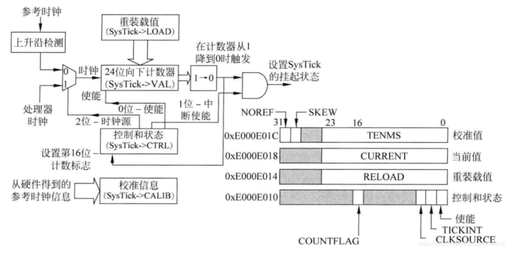

| 寄存器名称 | 寄存器描述       |
| ---------- | ---------------- |
| CTRL       | 控制及状态寄存器 |
| LOAD       | 重装载数值寄存器 |
| VAL        | 当前数值寄存器   |
| CALIB      | 校准数值寄存器   |
```c
/
**
* @brief This function provides minimum delay (in milliseconds) based
* on variable incremented.
* @note In the default implementation , SysTick timer is the source of time base.
* It is used to generate interrupts at regular time intervals where uwTick
* is incremented.
* @note This function is declared as __weak to be overwritten in case of other
* implementations in user file.
* @param Delay specifies the delay time length, in milliseconds.
* @retval None
*/
__weak void HAL_Delay(uint32_t Delay)
{
  uint32_t tickstart = HAL_GetTick(); // 获取uwTick的值
  uint32_t wait = Delay;
  /* Add a freq to guarantee minimum wait */
  if (wait < HAL_MAX_DELAY)
  {
    wait += (uint32_t)(uwTickFreq); // 加上1 , 最少延时1ms
  } 
  // 实时获取uwTick的值 , 差值>=wait 表示延时时间到, 结束while循环
  while ((HAL_GetTick() - tickstart) < wait)
  {

  }
}
```
---

### 5.2 通用定时器
##### STM32F1 系列中，除了互联型的产品，共有 8 个定时器，分为基本定时器，通⽤定时器和⾼级定时器
- 基本定时器 TIM6 和 TIM7 是⼀个 16 位的只能向上计数的定时器，只能定时，没有外部 IO
- 通⽤定时器 TIM2/3/4/5 是⼀个 16 位的可以向上/下计数的定时器，可以定时，可以输出⽐较，可以输⼊捕捉，每个定时器有四个外部
IO
- ⾼级定时器 TIM1/8 是⼀个 16 位的可以向上/下计数的定时器，可以定时，可以输出⽐较，可以输⼊捕捉，还可以有三相电机互补输出信
号，每个定时器有 8 个外部 IO

// Tout = 1 / (Tclk / (psc + 1)) ∗ (arr + 1)
// 定时器时钟Tclk： 72MHz
// 预分频器psc： 71
// 定时器每递减1次是1us
// 定时器是16位的: 65536 * 1us = 65.536ms
```c
// 最长延时时间为 65.535ms , 使用的时候要注意
void Delay_Us(uint32_t us)
{
  HAL_TIM_Base_Start(&htim3); // 启动TIM3
  __HAL_TIM_SET_COUNTER(&htim3, 0); // 设置TIM3的值为0
  // 等待计数器达到指定的微秒数
  while (__HAL_TIM_GET_COUNTER(&htim3) < us) {
  } 
    HAL_TIM_Base_Stop(&htim3);
  } 
  
void Delay_Ms(uint32_t ms)
{
  for(int i=0;i<ms;i++)
  {
    Delay_Us(1000);
  }
}
```
---

### 5.3 PWM（脉冲宽度调制）
#### STM32的每个通⽤定时器都有独⽴的4个通道可以⽤来作为：输⼊捕获、输出⽐较、PWM输出、单脉冲模式输出等 STM32的定时器除了TIM6和TIM7（基本定时器）之外，其他的定时器都可以产⽣PWM输出。其中，⾼级定时器TIM1、TIM8可以同时产⽣7路PWM输出
#### 工作模式

##### PWM模式1(向上计数) :计数器从0计数加到⾃动重装载值(TIMx_ARR)，然后重新从0开始计数，并且产⽣⼀个计数器溢出事件 
##### PWM模式2(向下计数) :计数器从⾃动重装载值(TIMx_ARR)减到0，然后重新从重装载值(TIMx_ARR)开始递减，并且产⽣⼀个计数器溢出事件
##### 占空⽐（Duty Cycle）是⽤来描述周期性信号中，⾼电平（或活动状态）时间相对于整个周期时间的⽐例。它通常⽤百分⽐表⽰
---

## 第六章 USART 通用同步异步收发器

### 6.1 通⽤同步异步收发器（Universal Synchronous Asynchronous Receiver and Transmitter）是⼀个串⾏通信设备，可以灵活地与外部设备进⾏全双⼯数据交换  

---
- 输入重定向
```c
#include "stdio.h"
int fputc(int ch, FILE *f)
{
  HAL_UART_Transmit(&huart1 , (uint8_t *)&ch, 1, 0xFFFF);
  return ch;
}
```
### 6.2 按键抖动
#### 通常按键抖动所⽤的开关都是机械弹性开关，当机械触点断开、闭合时，由于机械触点的弹性作⽤，⼀个按键开关在闭合时不会⻢上就稳定的接通，在断开时也不会⼀下⼦彻底断开，⽽是在闭合和断开的瞬间伴随着⼀连串的抖动  
#### 消抖
- 1. 延时消抖⽅法是通过设置⼀个较短的时间延迟，在此期间忽略其他的按键信号，只接受⾸次触发的按键信号  
- 2. 状态机消抖⽅法是通过状态的转换来判断按键信号的有效性，只有在按键信号稳定⼀段时间后才被认为是有效的  
- 3. 滤波电容可以在按键信号输⼊端引⼊⼀个电容，通过电容的充放电过程来平滑信号，减少抖动
- 4. RC电路是通过在按键信号输⼊端串联⼀个电阻和电容，利⽤RC的充放电时间常数来实现消抖 

```c
//延时消抖
static uint32_t old_uwTick =0;
if( (uwTick - old_uwTick) < 200 ) return ;
// uwTick 是全局变量, 每隔1ms 累加一次
// 第1次进入时 , 时间差会大于200 , if( (uwTick - old_uwTick) < 200 ) 这个条件不成立
// 第2次进入时 小时200ms时 不满足条件, 会直接返回
// 等时间差大于200ms时, 可以再次触发中断
old_uwTick = uwTick ;
```
---

###    6.3 USART接收与发送

```c
HAL_UART_Transmit(); // 串口发送数据， 使用超时管理机制
HAL_UART_Receive(); //串口接收数据， 使用超时管理机制
HAL_UART_Transmit_IT(); //串口中断模式发送
HAL_UART_Receive_IT(); //串口中断模式接收
HAL_UART_Transmit_DMA(); //串口DMA模式发送
HAL_UART_Transmit_DMA(); //串口DMA模式接收
HAL_UART_IRQHandler(UART_HandleTypeDef *huart); //串口中断处理函数
// complete 缩写 cplt
HAL_UART_TxCpltCallback(UART_HandleTypeDef *huart); //串口发送中断回调函数
HAL_UART_TxHalfCpltCallback(UART_HandleTypeDef *huart); //串口发送一半中断回调函数（用的较少）
HAL_UART_RxCpltCallback(UART_HandleTypeDef *huart); //串口接收中断回调函数
HAL_UART_RxHalfCpltCallback(UART_HandleTypeDef *huart);//串口接收一半回调函数（用的较少）
HAL_UART_ErrorCallback(); //串口接收错误函数
```
---

## 第七章 DMA 直接内存访问

### DMA是⼀种数据传输⽅式，它允许外设直接访问内存，⽽不需要CPU的⼲预。在传统的数据传输⽅式中，CPU需要通过中断或轮询的⽅式来处理数据传输，这会占⽤CPU的时间和资源。⽽使⽤DMA，外设可以直接与内存进⾏数据传输，从⽽减轻了CPU的负担，提⾼了系统的效率 

### 7.1 DMA发送函数
```c
//函数主要功能是以DMA模式发送pData指针指向的数据中固定⻓度的数据，并同时设置和使能DMA中断
HAL_UART_Transmit_DMA(UART_HandleTypeDef *huart, uint8_t *pData, uint16_t Size)
```
---

### 7.2 DMA接收函数
```c
//此函数的功能在DMA模式下接收⼤量数据，同时设置DMA线和哪个串⼝外设连接，以及将DMA线接收到的数据搬 *pData对应地内存中
HAL_StatusTypeDef HAL_UART_Receive_DMA(UART_HandleTypeDef *huart, uint8_t *pData, uint16_t Size)
```
---

### 7.3 DMA定长接收
- Priority
  ##### 当发⽣多个 DMA 通道请求时，就意味着有先后响应处理的顺序问题，这个就由仲裁器也管理。仲裁器管理 DMA 通道请求分为两个阶段。第⼀阶段属于软件阶段，可以在 DMA_CCRx 寄存器中设置，有 4 个等级：⾮常⾼、⾼、中和低四个优先级。第⼆阶段属于硬件阶段，如果两个或以上的 DMA 通道请求设置的优先级⼀样，则他们优先级取决于通 道编号，编号越低优先权越⾼，⽐如通道 0 ⾼于通道 1。在⼤容量产品和互联型产品中，DMA1 控制器拥有⾼于 DMA2 控制器的优先级  
- Mode
  ##### Normal 表⽰单次传输，传输⼀次后终⽌传输  
  ##### Circular  表⽰循环传输，传输完成后⼜重新开始继续传输，不断循环永不停⽌  
- Increment Address
  ##### Peripheral 表⽰外设地址⾃增  
  ##### Memory 表⽰内存地址⾃增  
##### 串⼝发送数据是将数据不断存进串⼝的发送数据寄存器(USARTx_TDR)。所以外接的地址是不递增。⽽内存储器存储的是要发送的数据，所以地址指针要递增才能将所以的数据发送出去  
- Data Width
  ##### Byte ⼀个字节  
  ##### Half Word 半个字，等于两字节    
  ##### Word ⼀个字，等于四字节  
  ##### 串⼝数据发送寄存器只能存储8bit，每次发送⼀个字节，所以数据⻓度选择Byte  
---

### 7.4 DMA不定长接收
#### 1. 发送接收方式
- 轮询
  ##### 它每次接收⼀个字节，在规定时间内接收固定⻓度的数据。在对于某些数据不固定⻓度接收的数据，轮询的⽅式有时候不够灵活  
- 中断
  ##### 使⽤中断的⽅式，如每⼀个字节都中断⼀次，当时⽐较消耗系统资源。特别是HAL库中，从中断到回调函数运⾏了不少的程序，频繁的中断很可能造成数据溢出。为了避免这个问题，我们使⽤指定接收⼀定⻓度的数据，再调⽤回调函数，这会让我们可以接收⼤数据，但是这种情况则造成了，要求每次的包是固定⻓度  
- DMA
  ##### 为了解决以上⼀些问题，最常⽤的办法是使⽤空闲中断，即在串⼝空闲的时候，触发⼀次中断，通知内核，本次运输完成了。数据传输过程为了尽量不占⽤CPU的处理数据时间，所以就使⽤DMA接收串⼝的数据  

#### 2. 空闲中断
- 介绍
##### 空闲中断是接受数据后出现⼀个byte的⾼电平(空闲)状态，就会触发空闲中断。并不是空闲就会⼀直中断，准确的说应该是上升沿（停⽌位）后⼀个byte，如果⼀直是低电平是不会触发空闲中断的（会触发break中断）。所以为了减少误进⼊串⼝空闲中断，串⼝RX的IO管脚⼀定设置成Pull-up<上拉模式>，串⼝空闲中断只是接收的数据时触发，发送时不触发  
- 使用
##### 串⼝空闲中断的判定是：当串⼝开始接收数据后，检测到1字节数据的时间内没有数据发⽣，则认为串⼝空闲了，进⼊相应的串⼝中断。在中断内清除空闲中断标志位和调⽤串⼝回调函数，在回调函数内处理读取，判断，处理接收的⼀帧数据  
#### 3. DMA半满和完成中断
- 半满中断
  ##### 半满中断是当DMA传输的⼀半数据已经传输完成时触发的中断。这个中断可以⽤来通知CPU，表⽰已经传输了⼀部分数据，可以进⾏相关的处理操作  
- 满中断
  ##### 满中断是当整个DMA传输完成时触发的中断。这个中断⽤来通知CPU，表⽰整个数据传输已经完成，可以进⾏后续的处理  
```c
// DMA 接收到一半的中断
void HAL_UART_RxHalfCpltCallback(UART_HandleTypeDef *huart)
{
  if(huart->Instance == USART1)
  {
    uint8_t Length = DMA_BUF_SIZE/2 - RX1_Offset ;
    //printf("HLength=%d\n",Length);
    HAL_UART_Transmit(huart,RX1_Buf+RX1_Offset,Length,HAL_MAX_DELAY);
    RX1_Offset += Length;
  }
} 
// DMA传输完成中断 , 就是接收满了的时候 触发中断
void HAL_UART_RxCpltCallback(UART_HandleTypeDef *huart)
{
  if(huart->Instance == USART1)
  {
    uint8_t Length = DMA_BUF_SIZE - RX1_Offset ;
    HAL_UART_Transmit(huart,RX1_Buf+RX1_Offset,Length,HAL_MAX_DELAY);
    //printf("CLength=%d\n",Length);
    RX1_Offset = 0 ; // 清空dma 位置基准值
  }
} 
// 用户自定义的函数 ， 处理串口空闲中断
void USER_UART_IRQHandler(UART_HandleTypeDef *huart)
{
  if(huart->Instance == USART1) //判断是否是串口1
  {
    if(__HAL_UART_GET_FLAG(huart, UART_FLAG_IDLE) != RESET ) //判断是否是空闲中断
    {
      __HAL_UART_CLEAR_IDLEFLAG(huart); //清除空闲中断标志（否则会一直不断进入中断）
      //计算接收到的数据长度 : BUFFER_SIZE - __HAL_DMA_GET_COUNTER(&hdma_usart1_rx)
      uint8_t Length = DMA_BUF_SIZE - __HAL_DMA_GET_COUNTER(&hdma_usart1_rx) - RX1_Offset;
      HAL_UART_Transmit(huart,RX1_Buf+RX1_Offset,Length,HAL_MAX_DELAY);
      RX1_Offset += Length;
      //printf("ILength=%d\n",Length);
    }
  }
}
```
---

## 第八章 I2C总线

### 8.1 介绍
#### 1. “总线”指多个设备共⽤的信号线。在⼀个 I2C 通讯总线中，可连接多个 I2C 通讯设备，⽀持多个通讯主机及多个通讯从机  
#### 2. ⼀个 I2C 总线只使⽤两条总线线路，⼀条双向串⾏数据线(SDA) ，⼀条串⾏时钟线 (SCL) 数据线即⽤来表⽰数据，时钟线⽤于数据收发同步
#### 3. 每个连接到总线的设备都有⼀个独⽴的地址，主机可以利⽤这个地址进⾏不同设备之间的访问  
#### 4. 总线通过上拉电阻接到电源。当 I2C 设备空闲时，会输出⾼阻态，由上拉电阻把总线拉成⾼电平  
#### 5. 多个主机同时使⽤总线时，为了防⽌数据冲突，会利⽤仲裁⽅式决定由哪个设备占⽤总线  
#### 6. 具有三种传输模式：标准模式传输速率为 100kbit/s ，快速模式为 400kbit/s ，⾼速模式下可达 3.4Mbit/s，但⽬前⼤多 I2C 设备尚不⽀持⾼速模式
#### 7. 连接到相同总线的 IC 数量受到总线的最⼤电容 400pF 限制
---

### 8.2 通信过程

- 地址位之后，是传输⽅向的选择位，该位为 0 时，表⽰后⾯的数据传输⽅向是由主机传输⾄从机，即主机向从机写数据。该位为 1 时，则相反，即主机由从机读数据  
- ⼀般在第⼀次传输中，主机通过 SLAVE_ADDRESS 寻找到从设备后， 发送⼀段“数据”，这段数据通常⽤于表⽰从设备内部的寄存器或存储器地址(注意区分它 与 SLAVE_ADDRESS 的区别)；在第⼆次的传输中，对该地址的内容进⾏读或写  第⼀次通讯是告诉从机读写地址，第⼆次则是读写的实际内容  
---

### 8.3 起始和停止信号
#### 信号只有在SCL高电平有效
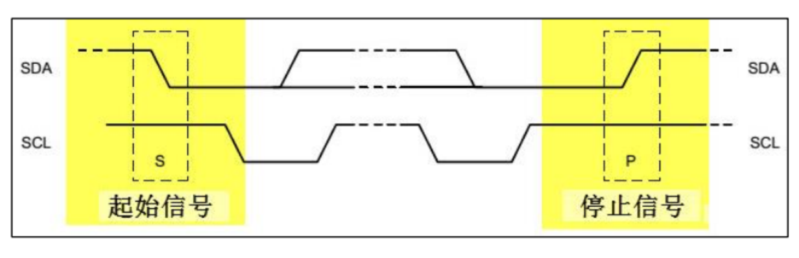
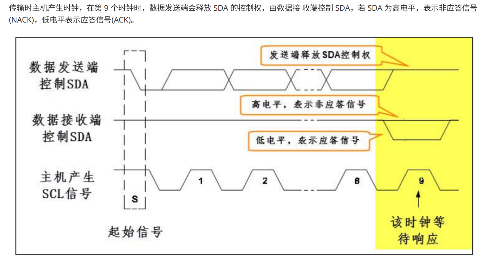
---

### 8.4 EEPROM(AT24C02)
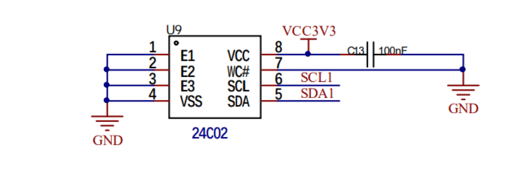
- 引脚图中 E1、E2、E3为器件地址引脚，GND为地，VCC为正电源，WP为写保护，SCL为串⾏时钟线，SDA为串⾏数据线。
- EEPROM 芯⽚中 WP 引脚具有写保护功能，当该引脚电平为⾼时，禁⽌写⼊数据，当引脚为低电平时，可写⼊数据，我们直接接地，不使⽤写保护功能
- AT24Cxx 设备地址为如下，前四位固定为 1010，E3~E1为由管脚电平决定。AT24Cxx EEPROM Board模块中默认为接地。E3~E1 为000，最后⼀位 R/W 表⽰读写操作。所以由于 I2C 通讯时常常是地址跟读写⽅向连在⼀起构成⼀个 8 位数，当 R/W 位为 0 时，表⽰写⽅向，所以加上 7 位地址，其值为 **0xA0**，常称该值为 I2C 设备的“写地址”当  R/W 位为 1 时，表⽰读⽅向，加上 7 位地址，其值为 **0xA1**，常称该值为“读地址”
```c
//write
#if 0
  // 每次写1个字节
  for(uint16_t i=0;i < N;i++)
  {
    // i 是eeprom的内存地址
    // AT24C02_ADDRESS_WRITE 是24c02的地址
    // 1000 是超时时间
    HAL_I2C_Mem_Write(&hi2c1, AT24C02_ADDRESS_WRITE,i,I2C_MEMADD_SIZE_8BIT,&src[i],1, 1000);
    HAL_Delay(5) ; // 这个延时必须的 , 等待数据写入到掉电非易失区
  }
#else
  // 每次写8个字节 , 每次写1页
  for(uint16_t i=0;i < N;i +=8)
  {
    // i 是eeprom的内存地址
    // AT24C02_ADDRESS_WRITE 是24c02的地址
    // 1000 是超时时间
    HAL_I2C_Mem_Write(&hi2c1, AT24C02_ADDRESS_WRITE,i,I2C_MEMADD_SIZE_8BIT,&src[i],8, 1000);
    HAL_Delay(5) ; // 这个延时必须的 , 等待数据写入到掉电非易失区
  }
#endif
```
```c
//read
#if 0
  // 1次读1个字节
  for(uint16_t i =0 ;i< N;i++)
  {
    // i 是eeprom的内存地址
    // AT24C02_ADDRESS_READ 是24c02的地址
    // 1000 是超时时间
    HAL_I2C_Mem_Read(&hi2c1, AT24C02_ADDRESS_READ,i,I2C_MEMADD_SIZE_8BIT,&dst[i],1,1000);
    HAL_Delay(1);
  }
#else
  // 0 : 表示的是起始地址
  // dst : 这个的地址会自动增加
  // N : 表示地址增加的数量
  HAL_I2C_Mem_Read(&hi2c1,AT24C02_ADDRESS_READ,0,I2C_MEMADD_SIZE_8BIT,dst,N,1000);
#endif
```
---

### 8.5 OLED

#### SSD1306是⼀款带控制器的⽤于OLED点阵图形显⽰系统的单⽚CMOS OLED/PLED驱动器。它由128个SEG（列输出）和64个COM（⾏输出）组成。该芯⽚专为共阴极OLED⾯板设计。I2C接⼝⽀持100KHz和400KHz 的速度模式。IIC总线包含从机地址位 SA0，数据信号SDA和时钟信号线 SCL组成。SDA和SCL线都必须接上拉电阻，RES#⽤来初始化芯⽚。IIC设备在数据传输之前都必须识别从机地址。SSD1306的从机地址有 0111100b 和 0111101b 两种，通过将SA0(D/C#)脚上拉到⾼电平可以设置从机地址第七位为 1，将SA0(D/C#)脚下拉到低电平可以设置从机地址第七位为 0 因此通过调整0R电阻，屏可以0x78和0x7A两个地址 -- 默认**0x78**(8位地址)
#### 写⼊时序
- 1. 主机先发起开始（START）信号，然后发送1byte⾸字节，包括从机地址(7位)和读写数据位(1位，最低位，0为写模式)，驱动器识别
从机地址为本机地址之后，将会发出应答信号(ACK) 
- 2. 主机收到从机的应答信号之后，随后传输1byte控制字节
- 3. 收到控制字节ACK信号之后，传输要写⼊的数据字节
- 4. 传输完毕之后主机发出结束（STOP）信号
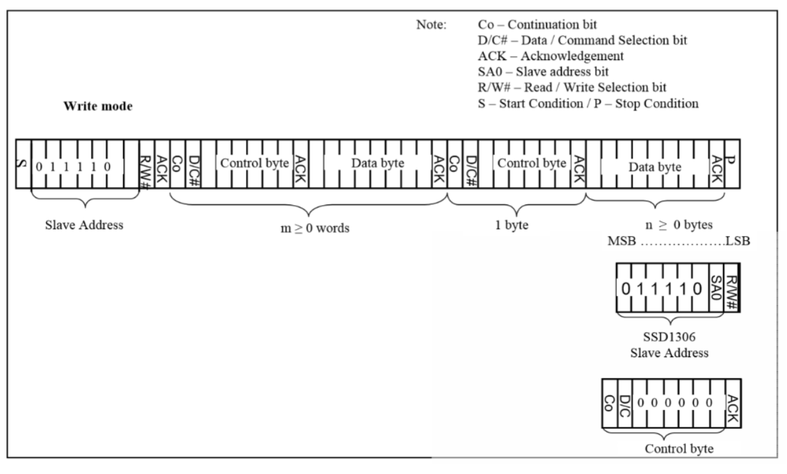
#### GDDRAM
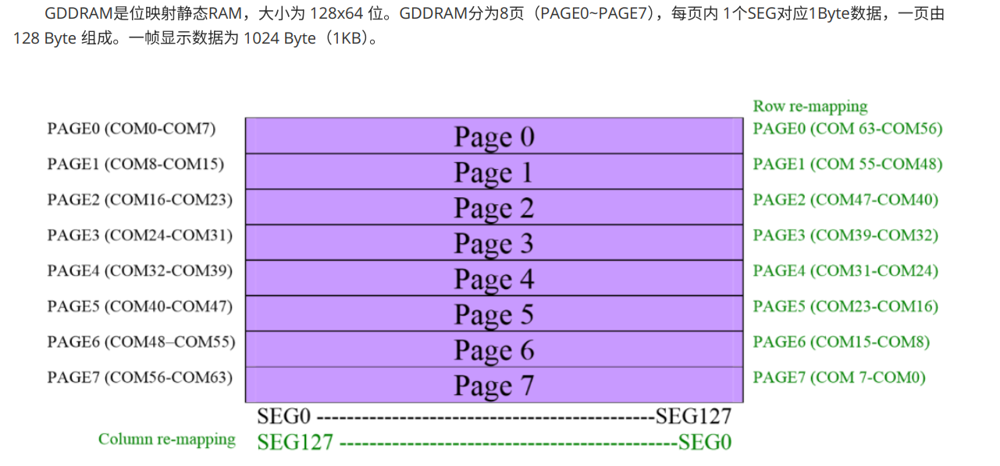
---

### 8.6 AHT20 温湿度传感器
#### 1. 器件地址
##### 在I2C通信中，这个地址⽤于与主控制器进⾏通信。需要注意的是，器件地址的最低位（LSB）⽤于指⽰读写操作，为0表⽰写操作，为1表⽰读操作。在 I²C 总线上，每个设备都有⼀个唯⼀的地址，这个地址⽤于识别总线上的各个设备。对于 AHT20 温湿度传感器，它的默认 I²C 地址通常是固定的，AHT20 的 I²C 地址是 0x38 (⼗六进制表⽰) 或者 56 (⼗进制表⽰)。组合成⼀个8位的地址的为：
- 写器件的地址：（(0x38<<1) = 0x70
- 读器件的地址：（(0x38<<1)|0x1 = 0x71

#### 2. 读写时序
##### 写命令时序：当主机想要触发 AHT20 的温湿度测量时，需要向 AHT20 发送⼀个写命令。
##### 基本步骤如下：
1. 起始条件：主机发送⼀个 I²C 起始条件。
2. 写⼊地址：主机写⼊ AHT20 的 I²C 地址（0x38）
3. 写⼊命令：主机发送⼀个命令字节，以触发温湿度测量。AHT20 ⽀持不同的命令字节，例如：
0xAC ：开始测量，不返回数据。
0xE1 ：开始测量，返回数据。
4. 确认：主机等待从设备确认接收到命令（ACK）
5. 停⽌条件：主机发送⼀个 I²C 停⽌条件。
6. 等待：AHT20 开始测量过程，并需要⼀定的时间来完成测量（典型的延迟时间可以在数据⼿册中找到）读取数据时序
##### 读取数据时序 ⼀旦 AHT20 完成了温湿度测量，主机就可以读取数据了
##### 基本步骤如下：  
1. 起始条件：主机发送⼀个 I²C 起始条件
2. 写⼊地址：主机写⼊ AHT20 的 I²C 地址（0x38）
3. 写⼊命令：主机发送命令字节 0xE0 ，以请求读取数据
4. 确认：主机等待从设备确认接收到命令（ACK）
5. 重复起始条件：主机发送⼀个 I²C 重复起始条件，准备读取数据。
6. 读取地址：主机发送 AHT20 的 I²C 地址（0x38），但是这次作为读取操作。
7. 读取数据：主机从 AHT20 读取数据，数据包括：
- 6 字节的数据（2 字节的湿度⾼位和低位，2 字节的温度⾼位和低位，2 字节的校验码 CRC）
8. ⾮ ACK 和停⽌条件：主机在读取最后⼀个字节后发送⼀个⾮ ACK，然后发送⼀个 I²C 停⽌条件
---

### 8.7 INA226 功率传感器
#### 器件地址
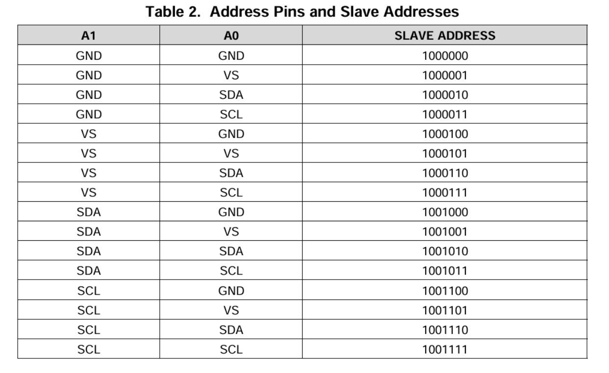
#### 配置寄存器
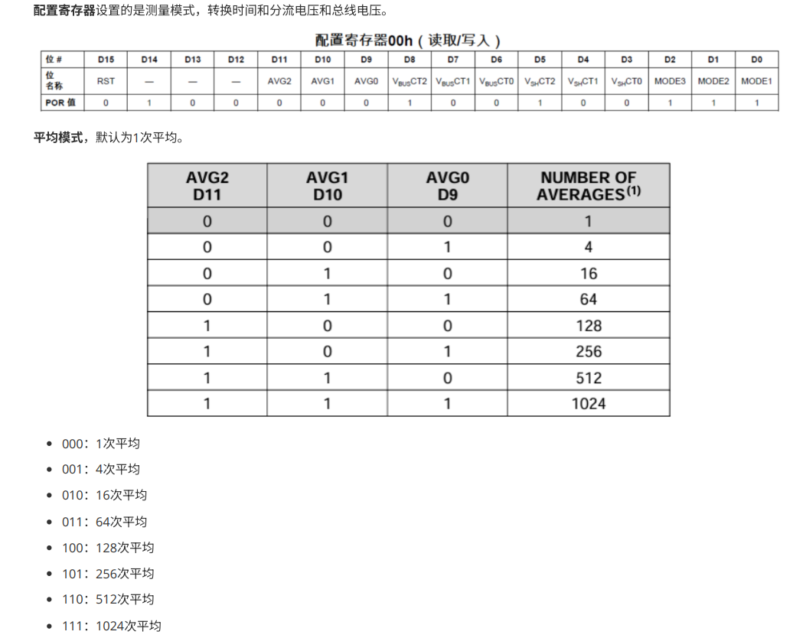
```c
/写配置寄存器
//0100_010_100_100_111 //16次平均,1.1ms,1.1ms,连续测量分流电压和总线电压
//0100 0101 0010 0111
// 4 5 2 7
//0100_011_111_111_111 //64次平均,8.2ms,8.2ms,连续测量分流电压和总线电压
//0100 0111 1111 1111
// 4 7 f f
//#define Configuration_Register_Init 0x4527
#define Configuration_Register_Init 0x47ff
void INA226_Init(void)
{
  uint8_t tData[3];
  tData[0] = Configuration_Register;
  tData[1] = Configuration_Register_Init >> 8;
  tData[2] = (uint8_t)Configuration_Register_Init;
  HAL_I2C_Master_Transmit(&hi2c1, INA226_ADDR, tData, 3, 0xff);
  HAL_Delay(5);
  tData[0] = Calibration_Register;
  tData[1] = Calibration_Register_Init >> 8;
  tData[2] = (uint8_t)Calibration_Register_Init;
  HAL_I2C_Master_Transmit(&hi2c1, INA226_ADDR, tData, 3, 0xff);
}
```

#### 校准寄存器
##### 这个寄存器为 INA226 提供了分流电阻值，这个电阻值⽤来校准测得的差分电压  
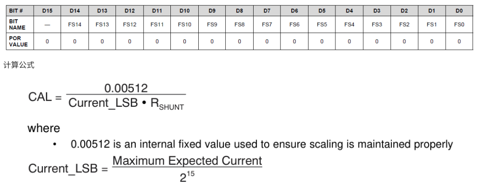
```c
//写校准寄存器
//LSB选择0.1mA,分压电阻选0.01R
// Cal=0.00512/(0.1mA*0.01R) * 1000 =5120
#define Calibration_Register_Init 5120
void INA226_Init(void)
{
  uint8_t tData[3];
  tData[0] = Configuration_Register;
  tData[1] = Configuration_Register_Init >> 8;
  tData[2] = (uint8_t)Configuration_Register_Init;
  HAL_I2C_Master_Transmit(&hi2c1, INA226_ADDR, tData, 3, 0xff);
  HAL_Delay(5);
  tData[0] = Calibration_Register;
  tData[1] = Calibration_Register_Init >> 8;
  tData[2] = (uint8_t)Calibration_Register_Init;
  HAL_I2C_Master_Transmit(&hi2c1, INA226_ADDR, tData, 3, 0xff);
}
```
---

## 第九章 Watchdog 看门狗定时器

### 9.1 介绍
#### STM32看⻔狗（Watchdog）是⼀种硬件定时器，⽤于监控和保护嵌⼊式系统的运⾏。它可以检测系统是否出现故障或死锁，并在发⽣故障时采取预定的操作来重置系统。STM32微控制器通常具有内部看⻔狗定时器，可以通过配置寄存器来启⽤和设置看⻔狗的计时周期。⼀旦启⽤，看⻔狗定时器开始倒计时，如果在指定的时间内没有重置或喂狗，看⻔狗将被触发，并执⾏预定的操作，如系统复位或中断
---

### 9.2 种类
#### 功能：
- 独⽴看⻔狗：基本的看⻔狗功能，具有单独的12位计时器，⽤于监控系统的运⾏。⼀旦启⽤，如果在指定的时间内没有重置或喂狗，独⽴看⻔狗将触发系统复位
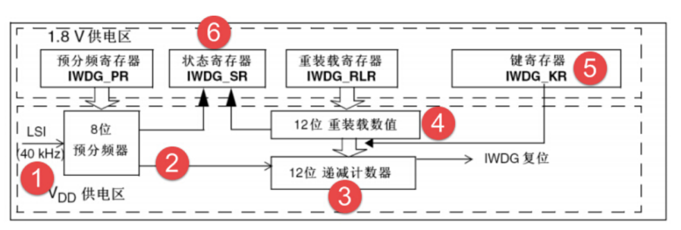
- 窗⼝看⻔狗：在独⽴看⻔狗的基础上增加了窗⼝功能。可以设置⼀个窗⼝时间范围，在此范围内喂狗可以防⽌看⻔狗触发。如果在窗⼝时间范围外或未及时喂狗，窗⼝看⻔狗将触发系统复位
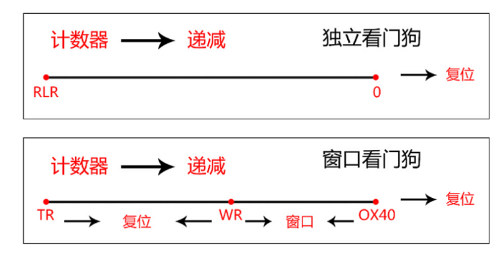
#### 喂狗机制：
- 独⽴看⻔狗：只需在规定的时间内定期重置或喂狗即可，否则会触发复位
- 窗⼝看⻔狗：需要在窗⼝时间范围内定期喂狗，如果在窗⼝时间范围外或未及时喂狗，会触发复位 窗口下限**0x40** 上限自己设置
---

## 第十章 RTC 实时时钟

### 10.1 介绍
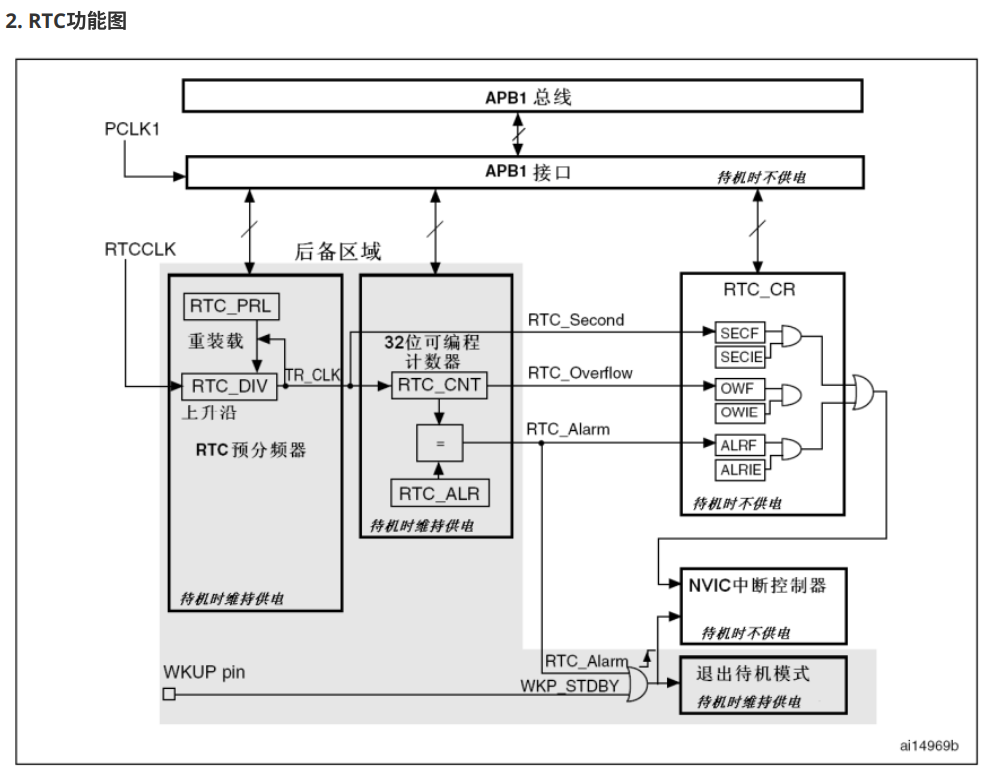
#### STM32的RTC模块是⼀个独⽴的硬件单元，⽤于提供⾼精度的时间和⽇期信息。它可以保持时间的计数，即使在微控制器断电的情况下也能保持准确。RTC模块通常由⼀个32位的计数器和⼀组寄存器组成，⽤于配置和控制RTC功能   
#### STM32的RTC模块提供了多种功能，包括：
- 1. 时间和⽇期计数：RTC模块可以提供精确的时间和⽇期计数，并⽀持闰年计算。
- 2. 闹钟功能：可以设置多个闹钟，以在指定时间触发中断或外部事件。
- 3. 外部事件检测：RTC模块可以检测外部事件（如电源故障），并触发相应的中断。
- 4. 低功耗模式：RTC模块可以在微控制器进⼊低功耗模式时继续运⾏，以保持时间计数的准确性。

#### 实时时钟（RTC） 是⼀个独⽴的 BCD 定时器/计数器。 RTC 提供具有可编程闹钟中断功能的⽇历时钟/⽇历。RTC 还包含具有中断功能的周期性可编程唤醒标志。两个 32 位寄存器包含⼆进码⼗进数格式 (BCD) 的秒、分钟、⼩时（ 12 或 24 ⼩时制）、星期⼏、⽇期、⽉份和年份。此外，还可提供⼆进制格式的亚秒值。系统可以⾃动将⽉份的天数补偿为 28、29（闰年）、30 和 31 天。只要芯⽚的备⽤电源⼀直供电，RTC上的时间会⼀直⾛
---

### 10.2 BKP 备份寄存器
#### 备份寄存器（BKP，backup）它的设计旨在提供⼀种可靠的⽅式来保存系统重要的配置信息和状态。BKP模块通常由多个备份寄存器组成，这些寄存器被设计成能够在断电或系统复位后保持其存储的数据。这样，即使系统重新启动，我们仍然可以从这些备份寄存器中恢复先前的状态

```bash
#define RTC_BKP_DR1 0x00000001U
#define RTC_BKP_DR2 0x00000002U
#define RTC_BKP_DR3 0x00000003U
#define RTC_BKP_DR4 0x00000004U
#define RTC_BKP_DR5 0x00000005U
#define RTC_BKP_DR6 0x00000006U
#define RTC_BKP_DR7 0x00000007U
#define RTC_BKP_DR8 0x00000008U
#define RTC_BKP_DR9 0x00000009U
#define RTC_BKP_DR10 0x0000000AU
```
---

### RTC如何实现时间掉电不重置
#### 在hal库中⽣成的代码，每次断电或复位就RTC时间会重置，每次上电都会重新初始化时间，为了解决这个为题， 需要在HAL库设置⼀个BKP寄存器保存⼀个标志。每次单⽚机启动时都读取这个标志并判断是不是预先设定的值：如果不是就初始化RTC并设置时间，再设置标志为预期值；如果是预期值就跳过初始化和时间设置，继续执⾏后⾯的程序
```c
/* USER CODE BEGIN Check_RTC_BKUP */
if(HAL_RTCEx_BKUPRead(&hrtc,RTC_BKP_DR1) != 0x5051)
{ 
/* USER CODE END Check_RTC_BKUP */
   /** Initialize RTC and set the Time and Date
  */
  sTime.Hours = 0x11;
  sTime.Minutes = 0x15;
  sTime.Seconds = 0x10;
  if (HAL_RTC_SetTime(&hrtc, &sTime, RTC_FORMAT_BCD) != HAL_OK)
  {
    Error_Handler();
  } 
  DateToUpdate.WeekDay = RTC_WEEKDAY_MONDAY;
  DateToUpdate.Month = RTC_MONTH_SEPTEMBER;
  DateToUpdate.Date = 0x11;
  DateToUpdate.Year = 0x23;
  if (HAL_RTC_SetDate(&hrtc, &DateToUpdate, RTC_FORMAT_BCD) != HAL_OK)
  {
    Error_Handler();
  } 
  /* USER CODE BEGIN RTC_Init 2 */
  HAL_RTCEx_BKUPWrite(&hrtc,RTC_BKP_DR1,0x5051); // 设置标志位, 表示时间已经被设置
}
```

### RTC时钟掉电不更新⽇期
#### RTC时钟例程项⽬中，虽然有外部电池供电，使得系统断电后依然能够计时，系统掉电或复位后，⽇期参数会重置，只有时间正常运⾏。这是因为STM32F103系列的RTC只是⼀个简单的计数器，同时因为STM32CubeMX⽣成的HAL库中RTC函数的设计缺陷，并没有办法实现万年历功能。

### RTC掉电不更新⽇期解决⽅法
#### 将⽇期参数保存到RTC后备区域存储器这种⽅法⽐较简单，在更新时间时，将⽇期参数保存⾄存储器中，数据掉电不丢失。但是没办法根治问题，断电时，⼀旦时间到达24:00，时间参数会重置从00:00重新开始计时，但是⽇期并不会更新。将⽇期和时间换算为时间戳保存在计数器中STM32F103的RTC本质上是⼀个32位的计数器，在断电后，由电池供电还能保持计数。所以可以将⽇期和时间换算为时间戳保存到计数器中，当需要读取时间时，从计数器中读取时间戳，重新换算成⽇期和时间即可

---

## 第十一章 PWR(power) 电源管理
### 11.1 睡眠模式、停⽌模式及待机模式中，若备份域电源正常供电，备份域内的 RTC 都可以正常运⾏，备份域内的寄存器的数据会被保存，不受功耗模式影响
---

### 11.2 种类
#### 这三种低功耗模式层层递进，运⾏的时钟或芯⽚功能越来越少，因⽽功耗越来越低
#### 睡眠模式 : 内核停⽌，所有外设包括M3核⼼的外设，如NVIC、系统时钟(SysTick)等仍在运⾏。
- 进⼊⽅式： 调⽤ WFI 命令。
- 唤醒⽅式：任意中断。
#### 睡眠模式：内核停⽌，所有外设包括M3核⼼的外设，如NVIC、系统时钟(SysTick)等仍在运⾏。
- 进⼊⽅式： 调⽤ WFE 命令。
- 唤醒⽅式：唤醒事件。
```c
  // 使用 LED2指示, 系统进入睡眠模式
  LED_Control(LED2,ON); // LED2 亮
  HAL_SuspendTick() ;// 暂停 滴答定时器 ， 因为嘀嗒定时器会产生1ms的中断， 必须关掉
  printf("System is sleeping\n");
  HAL_PWR_EnterSLEEPMode(PWR_MAINREGULATOR_ON,PWR_SLEEPENTRY_WFI) ; // 进入睡眠模式
  // 等待被唤醒 ........ , 可以按下6个按键中的任何一个即可唤醒 , 最好按下ESC,因为ESC默认动作时关闭蜂鸣器
  // 被唤醒后
  printf("System is wakeup\n");
  LED_Control(LED2,OFF); // LED2 灭
  HAL_ResumeTick(); // 恢复滴答定时器的计时
```
#### 停⽌模式 ：所有的时钟都已停⽌。
- 进⼊⽅式： 配置PWR_CR寄存器的 PDDS + LPDS 位+ SLEEPDEEP 位+ WFI 或 WFE 命令。
- 唤醒⽅式：任意外部中断 EXTI (在外部中断寄存器中设置)
```c
  // 使用LED1 指示灯, 指示系统正在运行
  printf("System is Running\n");
  LED_Control(LED1,ON); // LED1 亮
  HAL_Delay(2000); // 延时2秒
  LED_Control(LED1,OFF); // LED1 灭
  // 使用 LED2指示, 系统进入睡眠模式
  LED_Control(LED2,ON); // LED2 亮
  HAL_SuspendTick() ;// 暂停 滴答定时器
  printf("System is sleeping\n");
  //HAL_PWR_EnterSLEEPMode(PWR_MAINREGULATOR_ON,PWR_SLEEPENTRY_WFI) ; // 进入睡眠模式
  HAL_PWR_EnterSTOPMode(PWR_MAINREGULATOR_ON,PWR_SLEEPENTRY_WFI) ; // 进入stop模式 ,
  // 等待被唤醒 ........ , 可以按下6个按键中的任何一个即可唤醒 , 最好按下ESC,因为ESC默认动作时关闭蜂鸣器
  // 被唤醒后 使用hsi时钟
  SystemClock_Config(); // 需要重新配置时钟 72MHZ
  // 被唤醒后
  HAL_ResumeTick(); // 恢复滴答定时器的计时
  printf("\nSystem is wakeup\n");
  LED_Control(LED2,OFF); // LED2 灭
  // 获取重新配置后的时钟状态
  // 获取系统的时钟信息
  uint32_t SYSCLK_Frequency = HAL_RCC_GetSysClockFreq();
  uint32_t HCLK_Frequency = HAL_RCC_GetHCLKFreq();
  uint32_t PCLK1_Frequency = HAL_RCC_GetPCLK1Freq();
  uint32_t PCLK2_Frequency = HAL_RCC_GetPCLK2Freq();
  uint32_t SYSCLK_Source = __HAL_RCC_GET_SYSCLK_SOURCE();
  //printf("重新配置后的时钟状态： \n");
  printf("2: SYSCLK:%d,\n HCLK:%d,\n PCLK1:%d,\n PCLK2:%d,\n Source:%d (0 HSI , 8 PLLCLK)\n",
  SYSCLK_Frequency,HCLK_Frequency,PCLK1_Frequency,PCLK2_Frequency,SYSCLK_Source);
```
#### 待机模式 ： 1.8V电源关闭 。
- 进⼊⽅式：配置PWR_CR寄存器的 PDDS + SLEEPDEEP 位+ WFI 或 WFE 命令。
- 唤醒⽅式：WKUP上升沿、引脚的RTC闹钟事件、NRST引脚上的外部复位、IWDG复位
---

## 第十二章 ADC 模数转换器
### 12.1 ADC，全称为模数转换器（Analog-to-Digital Converter），是⼀种⽤于将模拟信号转换为数字信号的电⼦设备或模块。在嵌⼊式系统中，ADC常⽤于测量外部传感器的模拟信号，并将其转换为数字形式，以便于处理和分析
- 1. 多通道：可以同时测量多个模拟信号
- 2. 分辨率：指定ADC可以提供的数字输出精度，通常以位数表⽰，如10、12位、16位等
- 3. 采样速率：指定ADC模块对模拟信号进⾏采样的速率，通常以每秒采样次数（Samples per Second）表⽰
- 4. 触发模式：可以配置ADC在何时开始进⾏转换，如软件触发、定时触发或外部触发等
- 5. DMA⽀持：可以使⽤DMA（Direct Memory Access）来实现⾼效的数据传输，减轻CPU的负担
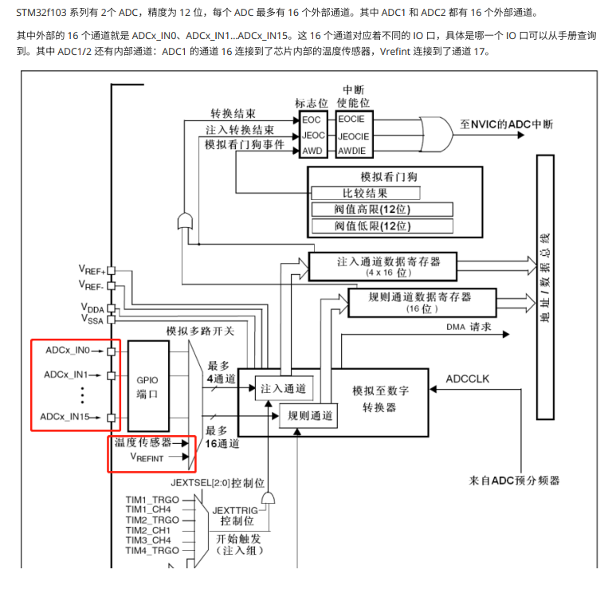
---

### 12.2 ADC时钟配置
#### ADC 的转换时间跟 ADC 的输⼊时钟和采样时间有关
- 公式为：Tconv = 采样时间 + 12.5 个周期。当 ADCLK = 14MHZ （最⾼），采样时间设置为 1.5 周期（最快），那么总的转换时间（最短）
- Tconv = 1.5 周期 + 12.5 周期 = 14 周期 = 1us。
- ⼀般我们设置 PCLK2=72M，经过 ADC 预分频器能分频到最⼤的时钟只能是 12M，采样周期设置为 1.5 个周期，算出最短的转换时间为
1.17us
```c
  uint8_t str[32]={0};
  OLED_ShowStr(16,0, (unsigned char*)"ADC VRCPU Test", 2);
  ADC_ChannelConfTypeDef sConfig = {0};
  sConfig.Channel = ADC_CHANNEL_1;
  sConfig.Rank = ADC_REGULAR_RANK_1;
  sConfig.SamplingTime = ADC_SAMPLETIME_239CYCLES_5;
  if (HAL_ADC_ConfigChannel(&hadc1, &sConfig) != HAL_OK)
  {
    Error_Handler();
  } 

  uint32_t adc_value = 0 ;
  for(uint8_t i=0;i<10;i++)
  {
    HAL_ADC_Start(&hadc1); // 启动ADC , 启动一次工作一次
    if(HAL_ADC_PollForConversion(&hadc1, 100) == HAL_OK ) // 等待adc 转换结束
    {
      adc_value += HAL_ADC_GetValue(&hadc1) ;
    }
  } 
  adc_value = adc_value /10 ; // 10次求平均
  // 0 -----0 v
  // 4095-----3.3v
  // val -----x v
  float val = (adc_value*3.3/4095);
  printf("VR : %.2fV\n",val);
  sprintf((char * )str,"VR : %.2fV",val);
  OLED_ShowStr(0,3,(unsigned char *)str,2); //测试6*16字符
  /**************************************************************/
  sConfig.Channel = ADC_CHANNEL_TEMPSENSOR;
  sConfig.Rank = ADC_REGULAR_RANK_1;
  sConfig.SamplingTime = ADC_SAMPLETIME_239CYCLES_5;
  if (HAL_ADC_ConfigChannel(&hadc1, &sConfig) != HAL_OK)
  {
    Error_Handler();
  } 
  adc_value = 0 ;
  for(uint8_t i=0;i<10;i++)
  {
    HAL_ADC_Start(&hadc1); // 启动ADC , 启动一次工作一次
    if(HAL_ADC_PollForConversion(&hadc1, 1000) == HAL_OK ) // 等待adc 转换结束
    {
      adc_value += HAL_ADC_GetValue(&hadc1) ;
    }
  } 
  adc_value = adc_value /10 ; // 10次求平均
  // 0 -----0 v
  // 4096 -----3.3v
  // adc_value -----val v
  val=(1.43-adc_value*3.3/4095)/0.0043+25;
  printf("CPU : %.1f C\n",val);
  sprintf((char * )str,"CPU : %.1f C",val);
  OLED_ShowStr(0,5,(unsigned char *)str,2);
  HAL_Delay(1000);
```
---

## 第十三章 SPI总线
### 13.1 SPI（Serial Peripheral Interface）是⼀种同步串⾏通信接⼝协议，⽤于在数字集成电路之间进⾏通信。SPI协议通常⽤于连接微控制器、传感器、存储器和其他外设 SPI协议使⽤主从架构，其中⼀个设备充当主设备，控制通信的时序和数据传输。其他设备则作为从设备，按照主设备的指令进⾏数据传输
#### SPI协议使⽤四根线进⾏通信：
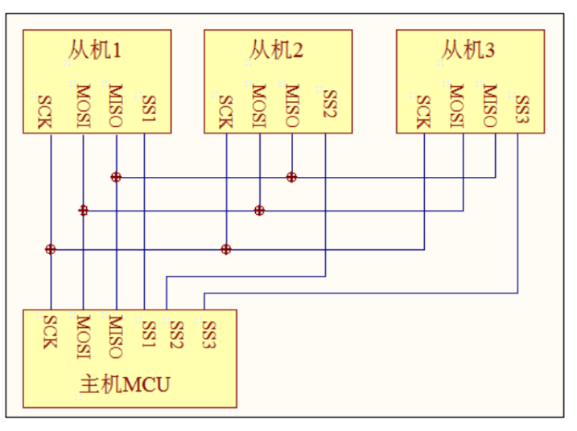
- SCLK（Serial Clock）：主设备产⽣的时钟信号，⽤于同步数据传输
- MOSI（Master Output Slave Input）：主设备发送数据的线路，等价于串⼝的TXD
- MISO（Master Input Slave Output）：从设备发送数据的线路，等价于串⼝的RXD
- SS（Slave Select）：⽤于选择从设备的线路
#### SPI协议的数据传输是全双⼯的，即主设备和从设备可以同时发送和接收数据。通信过程中，主设备通过SCLK产⽣时钟信号，同时发送数据到从设备的MOSI线路上。从设备接收到数据后，通过MISO线路将数据发送回主设备。数据的传输是按照时钟信号的上升沿或下降沿进⾏的
#### SPI协议还可以通过设置时钟极性（CPOL）和时钟相位（CPHA）来调整数据传输的时序。时钟极性定义了时钟信号在空闲状态时的电平，时钟相位定义了数据采样的时机
---

### 13.2 通信过程

---

### 13.2 CPOL/CPHA 及通讯模式
1. 模式0（CPOL = 0，CPHA = 0）：时钟信号在空闲状态下为低电平，数据在时钟信号的下降沿采样，上升沿传输 最常⻅的SPI模式
2. 模式1（CPOL = 0，CPHA = 1）：时钟信号在空闲状态下为低电平，数据在时钟信号的上升沿采样，下降沿传输
3. 模式2（CPOL = 1，CPHA = 0）：时钟信号在空闲状态下为⾼电平，数据在时钟信号的上升沿采样，下降沿传输
4. 模式3（CPOL = 1，CPHA = 1）：时钟信号在空闲状态下为⾼电平，数据在时钟信号的下降沿采样，上升沿传输
---

### 13.3 W25Q32
#### W25Q 系列为台湾华邦公司推出的是⼀种使⽤ SPI 通讯协议的 NOR FLASH 存储器。芯⽚型号后两位表⽰芯⽚容量，例如 W25Q32 的32就是指32Mbit 也就是 4M 的容量 它的 CS/CLK/DIO/DO 引脚分别连接到了 STM32 对应的 SPI 引脚 NSS/SCK/MOSI/MISO 上，其中 STM32 的 NSS 引脚虽然是其⽚上 SPI外设的硬件引脚，但实际上后⾯的程序只是把它当成⼀个普通的 GPIO，使⽤软件的⽅式控制 NSS 信号，所以在 SPI 的硬件设计中，NSS可以随便选择普通的 GPIO，不必纠结于选择硬件 NSS 信号 FLASH 芯⽚中还有 WP 和 HOLD 引脚。WP 引脚可控制写保护功能，当该引脚为低电平时，禁⽌写⼊数据。我们直接接电源，不使⽤写保护功能。HOLD 引脚可⽤于暂停通讯，该引脚为低电平时，通讯暂停，数据输出引脚输出⾼阻抗状态，时钟和数据输⼊引脚⽆效。我们直接接电源，不使⽤通讯暂停功能
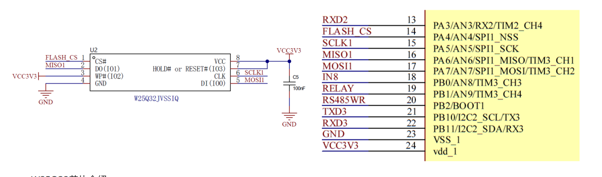
---

## 第十四章 CAN总线
### 14.1 CAN总线的特点和⼯作原理如下：
1. 多主从结构：CAN总线⽀持多个ECU连接到同⼀条总线上，这些ECU可以充当主设备或从设备。主设备负责发起数据传输，⽽从设备
则接收主设备发送的数据。
2. 差分信号传输：CAN总线使⽤差分信号传输，其中⼀对线路（CAN_H和CAN_L）⽤于传输数据。这种差分传输⽅式可以提供较强的抗
⼲扰能⼒，适应⼯业环境中的电磁⼲扰。
3. 优先级和仲裁：CAN总线采⽤基于标识符的仲裁机制，⽤于解决多个ECU同时发送数据的冲突。每个消息都有⼀个唯⼀的标识符，具
有较低标识符的ECU在总线上具有更⾼的优先级，可以在其他ECU发送数据时中断并发送⾃⼰的数据。
4. 帧格式：CAN总线使⽤帧格式来组织和传输数据。⼀个CAN帧包含标识符、数据、控制位和CRC（循环冗余校验）等字段。数据可以
是8字节的标准帧或者8到64字节的扩展帧。
5. 实时性和可靠性：CAN总线具有良好的实时性和可靠性，可以在繁忙的⽹络环境中传输数据。它⽀持快速的数据传输速率，通常可达
到1Mbps。
6. 错误检测和纠正：CAN总线具有强⼤的错误检测和纠正机制，可以检测和纠正数据传输过程中的错误。它使⽤CRC校验和错误标志位
来检测错误，并通过重传机制来纠正错误
---

### 14.2 物理层协议
#### 闭环⽹络：允许总线最⻓40m，最⾼速1Mbps
- 规定总线两端各有⼀个120Ω电阻
#### 开环⽹络：最⼤传输距离1Km，最⾼速125Kbps
- 规定每根线串联⼀个2.2kΩ的电阻
---

### 14.3 CAN协议差分信号。
#### 显性电平对应“0”，隐性电平对应“1”；隐性电平（1）两条线电压都是2.5V，即压差为0；显性电平（0）CAN_High和CAN_Low分别为3.5V和1.5V，压差为2V；总线上，只要有⼀个节点输出显性，则总线上为显性电平；只有所有节点都是隐性电平，总线才为隐性电平；由于CAN是半双⼯的，收发分开进⾏，且是总线通讯，所以⼀个时刻只能有⼀个节点发送，其他节点在此时只能接收
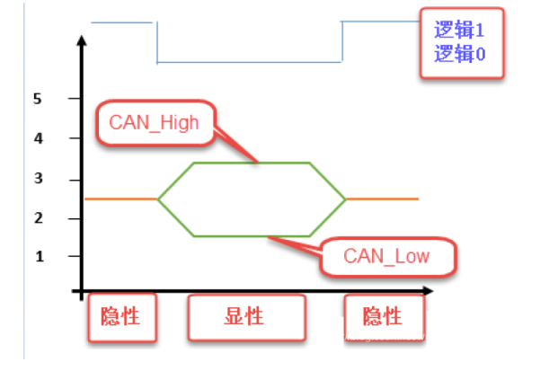

### 14.4 CAN的接收和发送
```c
/* USER CODE BEGIN 1 */
void CANFilter_Init(void)
{
  CAN_FilterTypeDef sFilterConfig;
  sFilterConfig.FilterBank = 0; //CAN过滤器编号， 范围0-27
  sFilterConfig.FilterMode = CAN_FILTERMODE_IDMASK; //CAN过滤器模式， 掩码模式或列表模式
  sFilterConfig.FilterScale = CAN_FILTERSCALE_32BIT; //CAN过滤器尺度， 16位或32位
  sFilterConfig.FilterIdHigh = 0x000 << 5; //32位下， 存储要过滤ID的高16位
  sFilterConfig.FilterIdLow = 0x0000; //32位下， 存储要过滤ID的低16位
  sFilterConfig.FilterMaskIdHigh = 0x0000; //掩码模式下， 存储的是掩码
  sFilterConfig.FilterMaskIdLow = 0x0000;
  sFilterConfig.FilterFIFOAssignment = 0; //报文通过过滤器的匹配后， 存储到哪个FIFO
  sFilterConfig.FilterActivation = ENABLE; //激活过滤器
  sFilterConfig.SlaveStartFilterBank = 0;
  if (HAL_CAN_ConfigFilter(&hcan, &sFilterConfig) != HAL_OK)
  { 
    Error_Handler();
  }
}

void CAN_Start_Init(void)
{
  if (HAL_CAN_Start(&hcan) != HAL_OK)
  {
    Error_Handler();
  }
  /* 3. Enable CAN RX Interrupt */
  if (HAL_CAN_ActivateNotification(&hcan, CAN_IT_RX_FIFO0_MSG_PENDING) != HAL_OK) {
  Error_Handler();
  }
}

void CAN_Test(void)
{
  uint8_t TX_Message[8] = {1,2,3,4,5,6,7,8};
  uint32_t pTxMailbox ;
  CAN_TxHeaderTypeDef TX_Header;
  TX_Header.IDE = CAN_ID_STD ; // 标准帧
  TX_Header.StdId = 0x12 ; // 消息的id号
  TX_Header.RTR = CAN_RTR_DATA ; // 数据帧
  TX_Header.DLC = 8 ; // 发送字节数
  if(HAL_CAN_AddTxMessage(&hcan, &TX_Header,TX_Message, &pTxMailbox) != HAL_OK)
  {
    Error_Handler();
  } 
  HAL_Delay(5000);
} 
/* USER CODE END 1 */
```
---

## 第十五章 RS485总线
### 15.1 电平
- 串⼝(UART)的电平协议: TTL ，电压范围 0-3.3V
- RS232的电平协议: 232，电压范围 +-25V ，串⼝的⾼电压版本 
- RS485的电平协议: 485，电压范围 +-6V ， 半双⼯差分信号传输
- RS422的电平协议: 422，电压范围 +-6V , 全双⼯差分信号传输，2个485总线
- RS-485和RS-232⼀样，都是串⾏通信标准，现在的标准名称是TIA485/EIA-485-A，但是⼈们会习惯称为RS-485标准，RS-485常⽤在⼯
业、⾃动化、汽⻋和建筑物管理等领域
- RS-485总线弥补了RS-232通信距离短，速率低的缺点，RS-485的速率可⾼达10Mbit/s，理论通讯距离可达1200⽶；RS-485和RS-232的单
端传输不⼀样，是差分传输，使⽤⼀对双绞线，其中⼀根线定义为A，另⼀个定义为B
---

### 15.2 差分运输
#### ⻓距离布线会有信号衰减，⽽且引⼊噪声和⼲扰的可能性更⼤，在线缆A和B上的表现就是电压幅度的变化，但是，采⽤差分线的好处就是，差值相减就会忽略掉⼲扰依旧能输出正常的信号，把这种差分接收器忽略两条信号线上相同电压的能⼒称为共模抑制
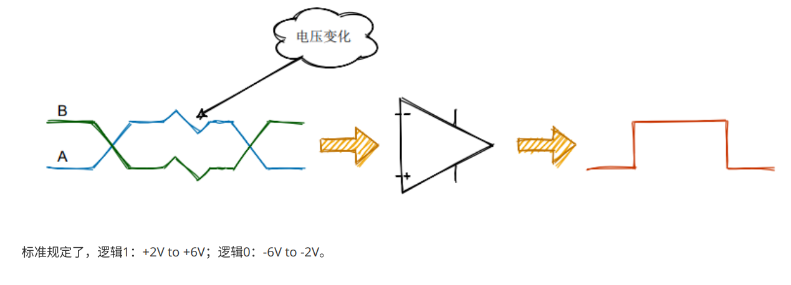
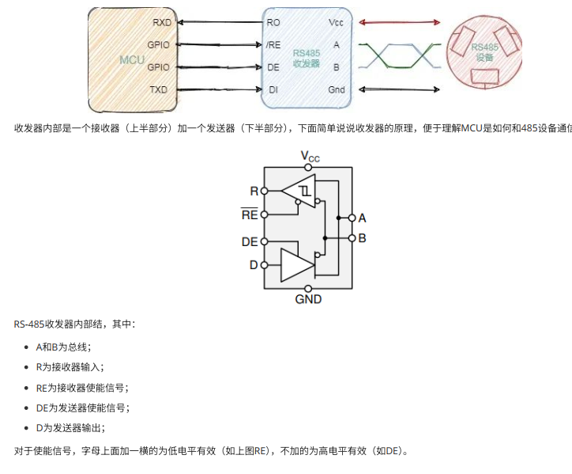
---

### 传输
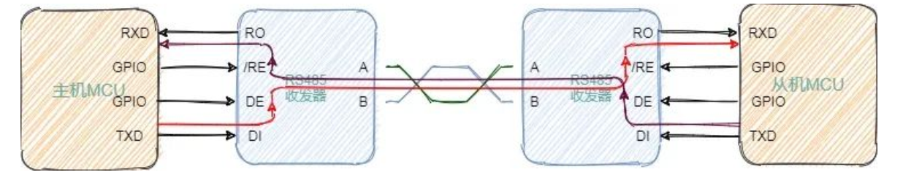
| 总线特性       | CAN总线                                | RS-485总线                       |
| -------------- | -------------------------------------- | -------------------------------- |
| 硬件成本       | 稍⾼                                   | 低廉                             |
| 总线利⽤率     | 优先级⾃动仲裁，利⽤率⾼               | 采⽤轮询，利⽤率低               |
| 数据传输率     | ⾼                                     | 低                               |
| 错误检测机制   | 控制器带校验机制，保证底层数据传输正确 | 只有物理层规范，⽆数据链路层规定 |
| 单节点故障影响 | 总线⽆影响                             | 总线瘫痪                         |
| 开发成本       | 软件开发灵活，时间成本低               | 开发难度较⼤                     |
| 系统成本       | 较低                                   | ⾼                               |


---
## 第十六章 WIFI模块
### 16.1 ESP8266模组特性
- 802.11 b/g/n
- 内置 Tensilica L106 超低功耗 32 位微型 MCU，主频⽀持 80 MHz 和 160 MHz，⽀持 RTOS
- 内置 10bit ⾼精度 ADC
- 内置 TCP/IP 协议栈
- 内置 TR开关、balun、LNA、功率放⼤器 和 匹配⽹络
- 内置PLL、稳压器和电源管理组件，802.11b 模式下 +20dBm 的输出功率
- A-MPDU 、A-MSDU 的聚合和 0.4s 的保护间隔
- WiFi @ 2.4GHz，⽀持 WPA/WPA2 安全模式
- ⽀持 AT远程升级 及云端 OTA升级
- ⽀持 STA/AP/STA+AP ⼯作模式
- ⽀持 Smart Config 功能（包括 Android 和 iOS 设备）
- HSPI 、UART、I2C、I2S、IR Remote Control、PWM、GPIO
- 深度睡眠保持电流为 10uA，关断电流⼩于 5uA2ms 之内唤醒、连接并传递数据包待机状态消耗功率⼩于 1.0mW (DTIM3)
- ⼯作温度范围：-40℃- 125℃
---

### 16.2 AT命令
1. AT：测试与模块的连接是否正常
2. AT+RST：重启ESP8266模块
3. AT+CWMODE=：设置Wi-Fi⼯作模式，mode可以是1、2或3，分别对应STA模式、AP模式和STA+AP模式
4. AT+CWJAP="afeiya","987654321"：连接到指定的Wi-Fi⽹络，需要提供SSID和密码
5. AT+CWLAP：列出附近可⽤的Wi-Fi⽹络
6. AT+CIPMODE=1：设置传输模式为透传模式
7. AT+CIPMUX=0：设置单链接模式
8. AT+CIPSTART="TCP","192.168.1.128",8000 ：建⽴与指定服务器的TCP或UDP连接，type可以是"TCP"或"UDP"，addr是服务器地址，port是端⼝号
9. AT+CIPCLOSE：关闭当前的TCP或UDP连接
10. AT+CIPSEND：进入透传
11. +++：退出透传 
---

## 第十七章 4G模块
### 17.1 ML307R-DC核⼼板介绍
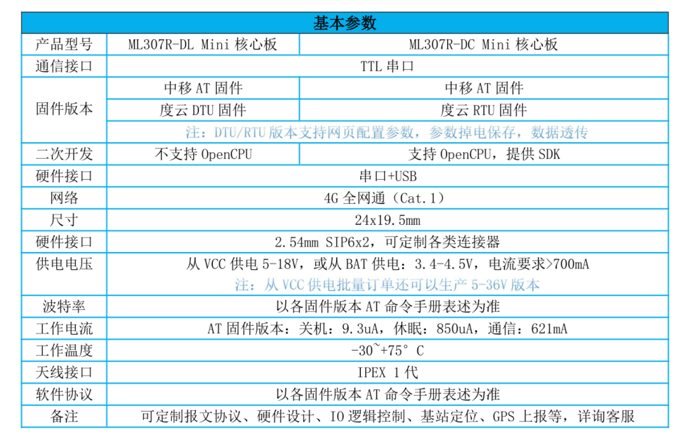
---

### 17.2 功能框图
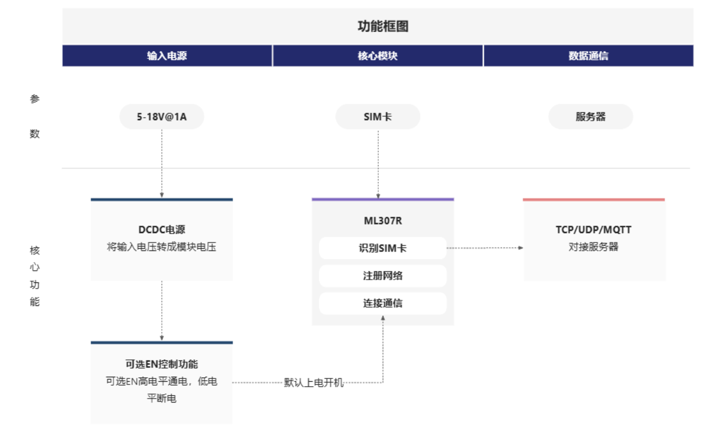
---

### 17.3 AT命令
1. ATI： 查询设备版本号
2. AT+REST： 设备重启
3. AT+IMEI?： 查询设备IMEI号
4. AT+IMSI?： 查询设备IMSI号
5. AT+ICCID?: 查询设备ICCID号
6. AT+CEREG?: 查询设备驻⽹状态
- 0 ： 未驻⽹
- 1 ： 驻⽹成功
- 3 ： 注册⽹路被拒绝
- 5 ： 驻⽹成功
7. AT+CSQ: 查询设备⽹路信号强度
- 0 ： -113 dBm or less
- 1 ： -111 dBm
- 2..30 ： -109. . . -53 dBm
- 31 ： -51 dBm or greater
- 99 ： 未知或⽆法检测
8. AT+DTUTASK: 设置DTU任务 AT+DTUTASK="<reserve>","<task_id>"
- 整形，通道 id ，范围 1~4。
- <task_id> 整型，任务 id ，默认值 0 。
- 参数说明：
0：⽆任务
10 ： SOCKET任务（TCP透传/UDP透传/多通道SOCK）
20 ： MQTT任务（单路透传/多通道MQTT）
22 ： ONENET任务（ONENET 物联⽹平台 MQTT 接⼊，属性点/数据流）
30 ： HTTP 透传模式
9. AT+SOCK 设置 SOCKET 参数 T+SOCK=1,1,"8.135.10.183",33778,0
- socket ⽀持最⼤ 4 路通道，每个通道完全独⽴，可分别设置参数，⽀持 TCP 和 UDP 如果没有使能多通道，则只有第⼀路设置会⽣效， AT+SOCKMULT 指令可以开启多通道

- 参数说明：
  整型，socket 通道标号，范围 1~4 
  整型，socket 通道使能，默认 0 [关闭] 
  0 : 关闭
  1 : 使能
  字符串，服务器地址，⽀持域名，范围 1-256
  整型，服务器端⼝号，范围是 0-65535
  整型，socket 通道的协议
  0 : TCP
  1 : UDP

  ---

  


